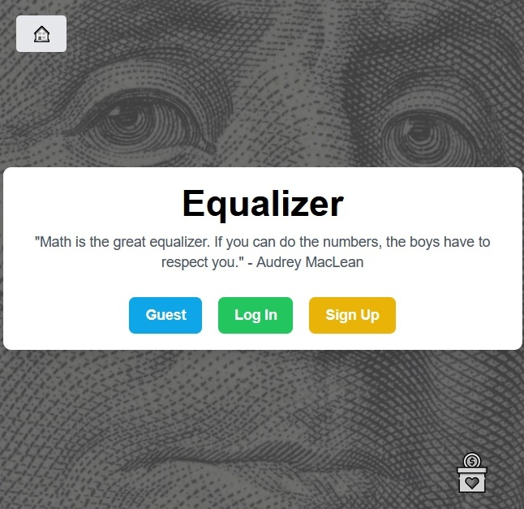
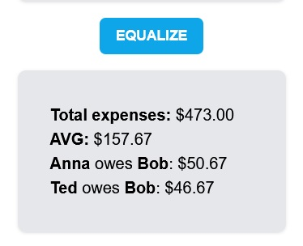
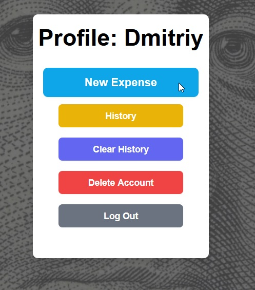

# Equalizer - Simplifying Shared Expenses

### Foundations Capstone Project: try live [app!](http://ec2-3-133-118-215.us-east-2.compute.amazonaws.com/)

Equalizer is a web application designed to make the management of shared expenses effortless and fair. Whether you're splitting bills with roommates, sharing costs on a group trip, or managing any group expenses, Equalizer ensures that everyone pays their fair share.

## Features

- Guest Mode: Quickly start adding participants and their expenses without needing to sign up.
- User Accounts: Sign up to access advanced features such as saving and viewing your expense history.
- Expense History: View a detailed log of all past expense entries, allowing you to track changes over time.
- Clear History: Easily clear your past expenses with a single click—ideal for starting fresh after each event or when beginning a new budget cycle.
- Delete Account: Provides users with the option to delete their account along with all associated data, ensuring user control over personal information.
- Intuitive Interface: An easy-to-use interface powered by TailwindCSS, allowing users to add, modify, and delete expenses with ease.
- Equalize Expenses: With the click of a button, Equalizer calculates the total, average, and how much each person owes or is owed.
- Secure: Passwords are hashed with bcrypt for security, and the app uses JWT for authentication.
- Responsive Design: The app is responsive, ensuring a seamless experience on both desktop and mobile devices.

## Technologies Used

Equalizer is built using the following technologies:

- JavaScript: The primary programming language used for both frontend and backend logic.
- Node.js & Express: These technologies form the backbone of the app server-side logic.
- MongoDB: The primary database for storing user data securely and efficiently.
- Mongoose: Facilitates interaction with MongoDB through elegant, schema-based solutions.
- Axios: Used for making HTTP requests from the web application to external services and APIs.
- CORS: Middleware to enable cross-origin resource sharing, allowing the API to be accessed from different domains.
- Bcrypt: Provides powerful password hashing functionalities to secure the users' data.
- Dotenv: Manages environmental variables in a development environment.
- JWT (JSON Web Tokens): Ensures secure transmission of information between parties as JSON objects.
- Rollbar: An error tracking and monitoring service that helps to maintain the reliability of my application.

## Getting Started

To start using Equalizer, you can either jump right in through Guest Mode or sign up for an account to enjoy enhanced functionalities such as expense history and secure data management.

## Using Equalizer

- Add Participants: Enter the names of individuals involved in the shared expenses.
- Enter Expenses: Log every expense and assign it to the respective participants.
- View History: Access your historical data to see past expenses and settlements.
- Manage Your Account: Update your account settings, clear history, or delete your account through the user dashboard.

## Security Features

Data Protection: We use bcrypt to secure your passwords and JWT to manage sessions, ensuring that your data remains safe.
Privacy Control: You have full control over your information, including the option to delete your account and clear your history.
